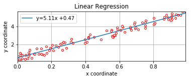
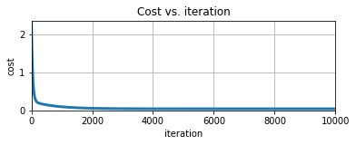

# Machine Learning with python
implementing my own python machine learning code

`linear regression` outputs the parameters for a hyperplane (a line in case of two dimensions) and the sum of squares of distance of the points from the found hyperplane. 

The code runs a one layer nerual network to minimize a cost function using gradient descent implemented all in the code. The cost function is the sum of squares of distance of the points from the hyperplane divided by the number of points. 

The second block of the notebook contains a sample run of the algorithm. We 
first generate some points in the [0,1]x[0,1] and then transform them with a matrix so that they look like they have some sort of correlation. The first coordinate(s) of the points is the input for training (X) and the last coordinate is what we check the distances with, (that is, y). 

`lamb` is the regularization factor, `alpha` is the step size, and `num_iters` is the number of iterations for the gradient descent.

In the last block of notebook we plot the points, the regresed line, and the cost funtion per iteration:

